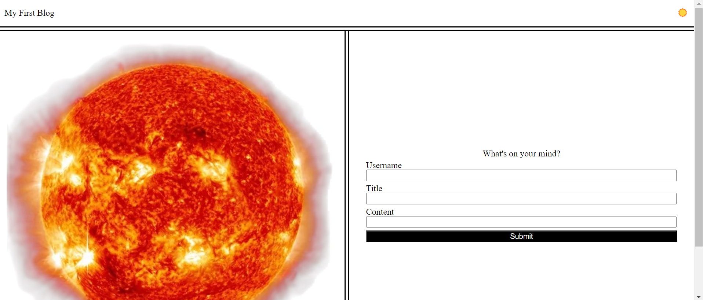
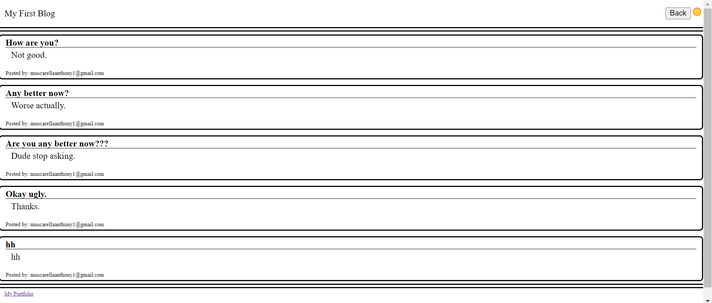

# PersonalBlog
This is a blog webiste that allows a user to submit a form that takes their username, title, and content of their post. After the user submits their post they are redirected to the blog page that shows the newest post as well as the previously made posts. There is also an option for the user to switch the theme back and forth from light mode to dark mods. I made this project to teach myself to recieve input, store it in local storage, and then extact the information in a new page. It was also good practice for making css elements from JavaScript and adding extra user accessibility. 

## Usage
To use this blog, follow the fields on the inital form page and submit your enrtry. Make sure to complete all 3 fields. After that your post will be formatted and printed on the blog page. In order to switch themes between light and dark, click the sun located in the top right corner of each page.

Form Page: 

Blog Page: 

## License
MIT License

Copyright (c) 2024 muscarellaanthony

Permission is hereby granted, free of charge, to any person obtaining a copy
of this software and associated documentation files (the "Software"), to deal
in the Software without restriction, including without limitation the rights
to use, copy, modify, merge, publish, distribute, sublicense, and/or sell
copies of the Software, and to permit persons to whom the Software is
furnished to do so, subject to the following conditions:

The above copyright notice and this permission notice shall be included in all
copies or substantial portions of the Software.

THE SOFTWARE IS PROVIDED "AS IS", WITHOUT WARRANTY OF ANY KIND, EXPRESS OR
IMPLIED, INCLUDING BUT NOT LIMITED TO THE WARRANTIES OF MERCHANTABILITY,
FITNESS FOR A PARTICULAR PURPOSE AND NONINFRINGEMENT. IN NO EVENT SHALL THE
AUTHORS OR COPYRIGHT HOLDERS BE LIABLE FOR ANY CLAIM, DAMAGES OR OTHER
LIABILITY, WHETHER IN AN ACTION OF CONTRACT, TORT OR OTHERWISE, ARISING FROM,
OUT OF OR IN CONNECTION WITH THE SOFTWARE OR THE USE OR OTHER DEALINGS IN THE
SOFTWARE.